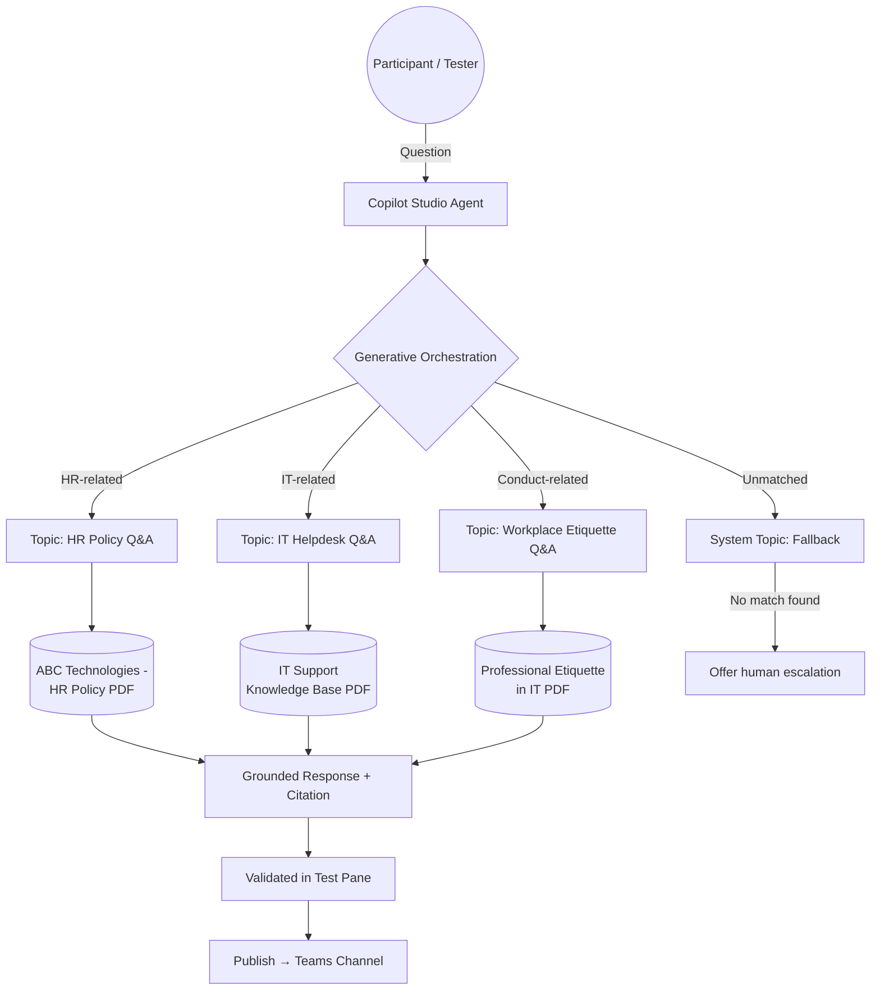

# Mini-Project 2 — Knowledge-Grounded Enterprise Support Agent (RAG)

Part of: [**AB-620_Microsoft_Certified_AI_Agent_Builder_Associate-E-Y_Oct_2026**](https://github.com/avyuktitech/AB-620_Microsoft_Certified_AI_Agent_Builder_Associate-E-Y_Oct_2026)
Reinforces: **Day 3** (Topics, Triggers & Generative Orchestration) and **Day 4** (Knowledge Sources & RAG)

---

## Objective

Build a single Copilot Studio agent that answers enterprise support questions by grounding its responses in **multiple real knowledge sources**, using generative orchestration (not fixed trigger phrases) to route between an FAQ-style topic and a knowledge-retrieval flow — then test it against the correct knowledge source for each question type.

---

## Scenario

Your organization wants one support agent that can answer both **HR policy** questions and **IT helpdesk** questions, citing the correct source document for each, and gracefully declining to answer anything outside those two domains.

---

## Knowledge Sources Used

| File | Domain | Source Type |
|---|---|---|
| `ABC Technologies-HR policy doc.pdf` | HR Policy | Uploaded document |
| `IT Support Knowledge Base_111.pdf` | IT Helpdesk | Uploaded document |
| `Professional_Etiquette_in_IT.pdf` | Workplace conduct | Uploaded document (used to test cross-domain/ambiguous queries) |

---

## Architecture

---

## Steps

1. **Create the agent** (or reuse the Day 1 agent) in your Dev environment.
2. **Add three knowledge sources** — upload all three PDFs listed above under the agent's **Knowledge** tab.
3. **Enable generative orchestration** (Settings → Generative AI) so the agent routes by meaning, not just fixed phrases.
4. **Author three lightweight topics** — HR Policy Q&A, IT Helpdesk Q&A, Workplace Etiquette Q&A — each scoped loosely by name/description so the orchestrator can select the right one; leave trigger phrases as secondary hints only.
5. **Customize the Fallback topic** to offer human escalation when a question matches none of the three domains (e.g. "What's the weather today?").
6. **Test using the evaluation template** — import test conversations using [`../EvalConversationTemplate.csv`](../EvalConversationTemplate.csv) (or extend it with HR/IT-specific question-and-answer pairs) to validate the agent against multiple conversations in one batch run.
7. **Verify citations** — confirm each response in the Test pane cites the correct source PDF, not a blended or incorrect one.
8. **Publish and verify in Teams**, same as the Day 1 lab.

---

## Deliverable / Checkpoint

✓ One agent, three knowledge sources, generative orchestration enabled, correctly citing the right PDF per question domain, with a customized Fallback for out-of-scope questions — validated via an imported test set and confirmed working in Microsoft Teams.

---

## Common Pitfalls

- **Cross-contamination:** if HR and IT documents use overlapping terminology (e.g. "request," "approval"), the agent may cite the wrong source — tighten topic descriptions and test explicitly for this.
- **Over-triggering Fallback:** if trigger phrases are too narrow and generative orchestration isn't actually enabled, legitimate questions worded differently than expected will incorrectly fall back to escalation — double-check the orchestration setting from Day 3 before troubleshooting the knowledge layer.
