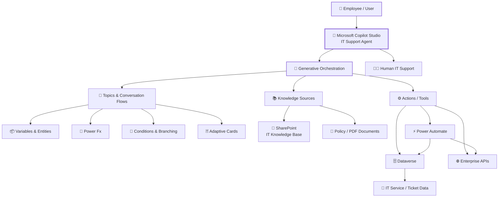
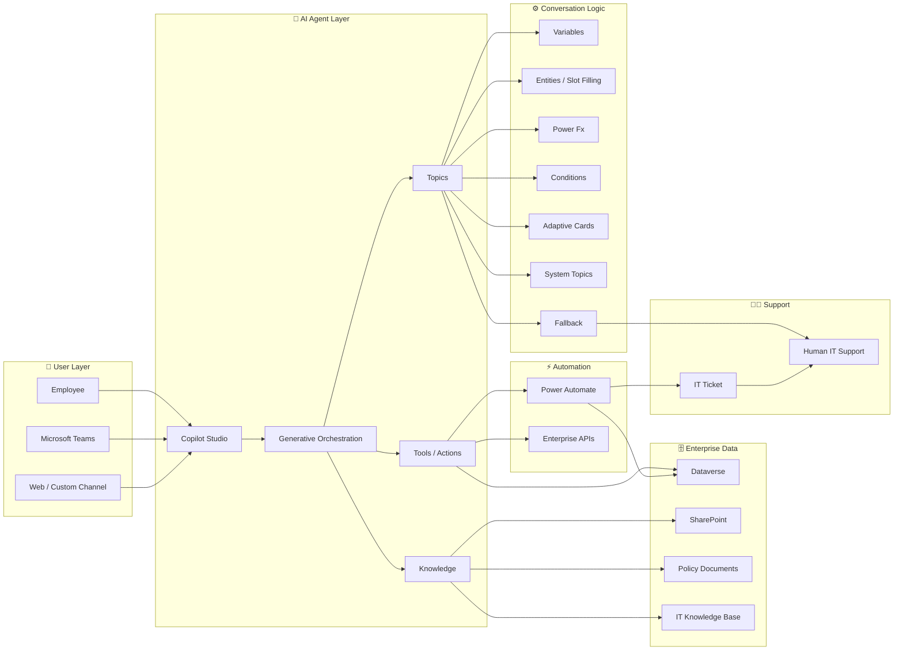
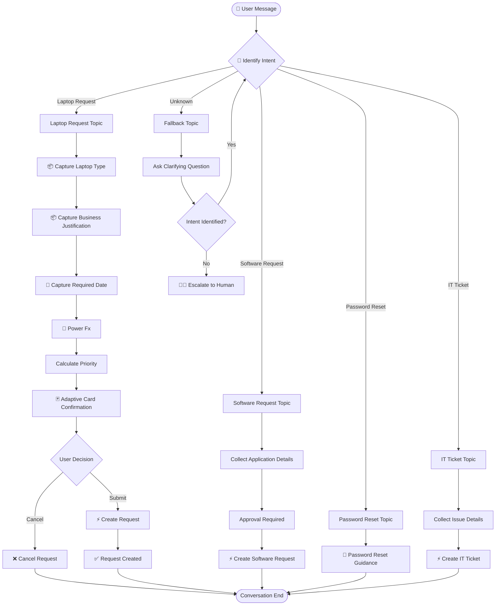
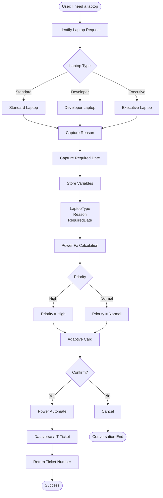
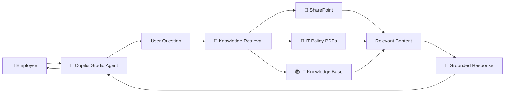
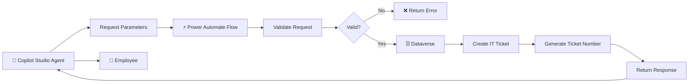
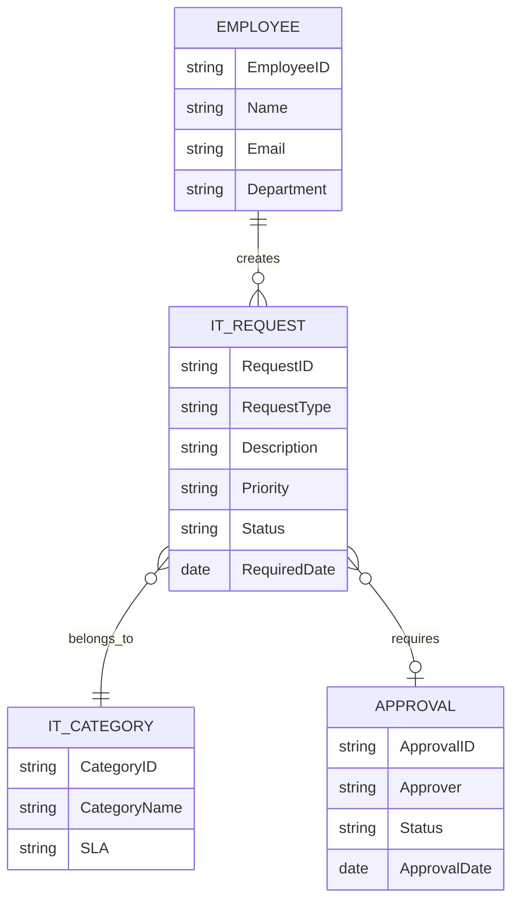
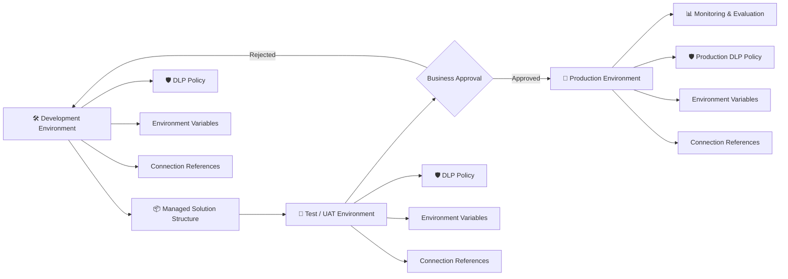
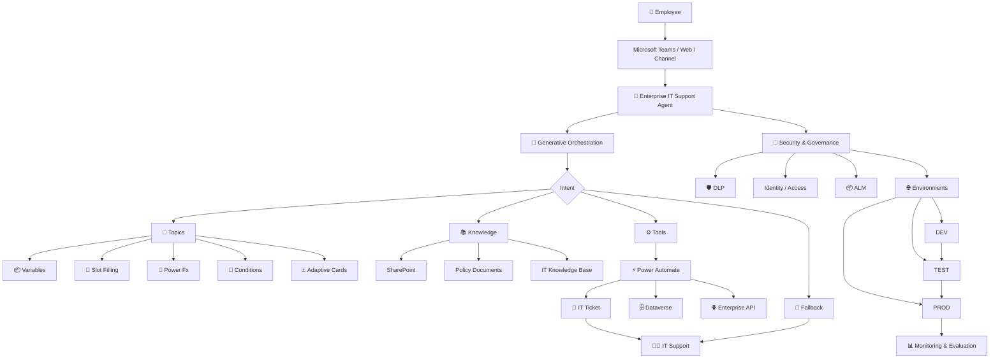

# 🏗️ Architecture & Wiring Diagrams

This section provides the visual architecture, component wiring, conversation flow, and integration diagrams for the Enterprise IT Support AI Agent.

---

# 1. Enterprise AI Agent — Block Diagram



---

# 2. Complete Solution Block Diagram



---

# 3. Agent Conversation Wiring Diagram

This diagram shows how a user request travels through the agent.



---

# 4. Laptop Request — Detailed Wiring Diagram



---

# 5. Knowledge Grounding — Wiring Diagram



---

# 6. Power Automate Integration — Wiring Diagram



---

# 7. Dataverse Wiring Diagram



---

# 8. Environment & ALM Wiring Diagram



---

# 9. Enterprise Security & Governance Wiring

```mermaid
flowchart TD

    GOVERNANCE[🏢 Enterprise Governance]

    GOVERNANCE --> IAM[🔐 Identity & Access]
    GOVERNANCE --> DLP[🛡️ DLP Policies]
    GOVERNANCE --> ENV[🌐 Environment Strategy]
    GOVERNANCE --> ALM[📦 ALM / Solutions]
    GOVERNANCE --> DATA[🔒 Data Governance]
    GOVERNANCE --> MON[📊 Monitoring]

    IAM --> RBAC[Role-Based Access]
    IAM --> MFA[Identity Controls]

    DLP --> BUSINESS[Business Connectors]
    DLP --> NONBUSINESS[Non-Business Connectors]
    DLP --> BLOCKED[Blocked Connectors]

    ENV --> DEV[Development]
    ENV --> TEST[Test / UAT]
    ENV --> PROD[Production]

    ALM --> SOLUTIONS[Solutions]
    ALM --> CONN[Connection References]
    ALM --> VARIABLES[Environment Variables]

    DATA --> DV[Dataverse]
    DATA --> SP[SharePoint]
    DATA --> API[Enterprise APIs]

    MON --> LOGS[Logs]
    MON --> EVAL[Agent Evaluation]
    MON --> ANALYTICS[Usage Analytics]
```



---

# 10. End-to-End Enterprise Wiring Diagram

This is the **master architecture diagram** for the complete mini-project.



---

# 11. User Request → AI Agent → Enterprise System

The complete request lifecycle can be summarized as:

```text
┌───────────────────────────────────────────────────────────────┐
│                         USER                                  │
│              "I need a developer laptop"                     │
└────────────────────────────┬──────────────────────────────────┘
                             │
                             ▼
┌───────────────────────────────────────────────────────────────┐
│                    COPILOT STUDIO                             │
│                                                               │
│  Generative Orchestration → Intent → Topic / Tool / Knowledge│
└────────────────────────────┬──────────────────────────────────┘
                             │
                             ▼
┌───────────────────────────────────────────────────────────────┐
│                  CONVERSATION LOGIC                           │
│                                                               │
│ Variables → Slot Filling → Conditions → Power Fx              │
└────────────────────────────┬──────────────────────────────────┘
                             │
                             ▼
┌───────────────────────────────────────────────────────────────┐
│                    USER CONFIRMATION                           │
│                     Adaptive Card                              │
└────────────────────────────┬──────────────────────────────────┘
                             │
                             ▼
┌───────────────────────────────────────────────────────────────┐
│                     POWER AUTOMATE                             │
└────────────────────────────┬──────────────────────────────────┘
                             │
                             ▼
┌───────────────────────────────────────────────────────────────┐
│                       DATAVERSE                                │
│                  IT Request / Ticket                           │
└────────────────────────────┬──────────────────────────────────┘
                             │
                             ▼
┌───────────────────────────────────────────────────────────────┐
│                    IT SUPPORT TEAM                             │
│                       👨‍💼                                    │
└───────────────────────────────────────────────────────────────┘
```

---

# 🔌 Component Wiring Summary

| Source         | Component                | Destination       | Purpose                |
| -------------- | ------------------------ | ----------------- | ---------------------- |
| Employee       | Copilot Studio           | Agent             | User interaction       |
| Agent          | Generative Orchestration | Topics/Tools      | Intent understanding   |
| Agent          | Knowledge                | SharePoint/PDF    | Grounded answers       |
| Topic          | Variables                | Conversation      | Maintain context       |
| Topic          | Power Fx                 | Business Logic    | Calculations           |
| Topic          | Adaptive Card            | User              | Confirmation           |
| Agent          | Power Automate           | Dataverse         | Transaction processing |
| Power Automate | API                      | Enterprise System | Integration            |
| Agent          | Fallback                 | Human Support     | Escalation             |
| Solution       | Connection Reference     | Connector         | ALM                    |
| Environment    | DLP                      | Connectors        | Governance             |
| DEV            | Solution                 | TEST              | Deployment             |
| TEST           | Solution                 | PROD              | Production deployment  |

---

# 🧪 Diagram-Based Validation

Participants should be able to trace the complete flow:

```text
User
 ↓
Channel
 ↓
Copilot Studio
 ↓
Generative Orchestration
 ↓
Intent
 ↓
Topic / Knowledge / Tool
 ↓
Variables
 ↓
Power Fx
 ↓
Condition
 ↓
Adaptive Card
 ↓
Power Automate
 ↓
Dataverse / API
 ↓
IT Ticket
 ↓
Human Support
```

The objective is not only to build the agent but also to understand **how every component is wired together in an enterprise AI solution**.
