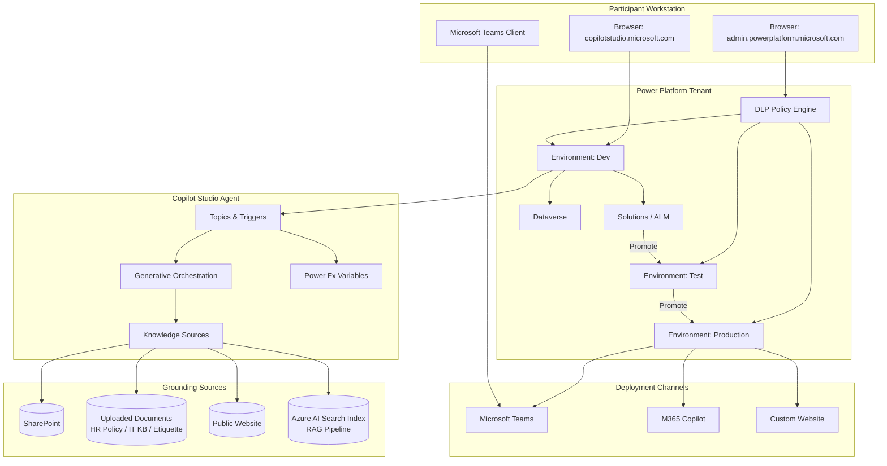
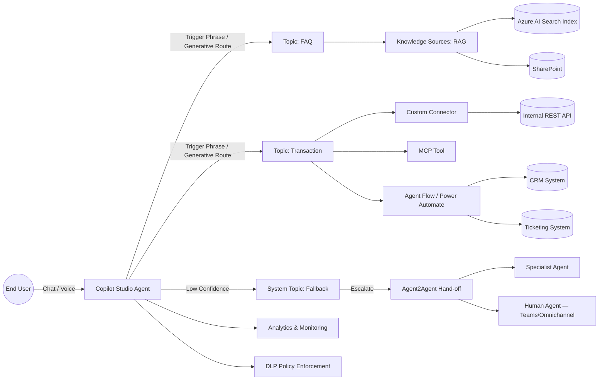

# AB-620 — Microsoft Certified: AI Agent Builder Associate
### EY Batch · October 2026 · Delivered by AVYUKTi Technologies

Designing and Building Integrated AI Agent Solutions in Microsoft Copilot Studio — a 5-day, hands-on, lab-driven program preparing participants for the **AB-620** certification exam.

| | |
|---|---|
| **Exam** | AB-620 · Level: Associate (Developer) · Duration: 120 min · Passing score: 700/1000 |
| **Domains** | Plan & configure (30–35%) · Integrate & extend (40–45%) · Test & manage (20–25%) |
| **Format** | 5 Days · 40 total hours · 30% concepts / 70% hands-on labs |
| **Client** | EY |
| **Cohort** | Oct 2026 |

---

## Repository Structure

```
AB-620_Microsoft_Certified_AI_Agent_Builder_Associate-E-Y_Oct_2026/
├── README.md                                   ← you are here
├── AB-620_Microsoft_Certified-AI_Agent_Builder_Associate.xlsx   (full day-wise content outline)
├── Lab_Accesses.xlsx                           (participant lab environment credentials/log)
├── AB650-DAY1-DashBoard.jpg                    (Day 1 sample dashboard screenshot)
├── ABC Technologies-HR policy doc.pdf          (sample knowledge source — HR agent labs)
├── IT Support Knowledge Base_111.pdf           (sample knowledge source — IT helpdesk agent labs)
├── Professional_Etiquette_in_IT.pdf            (sample knowledge source — RAG/grounding labs)
├── EvalConversationTemplate.csv                (agent test-set import template)
│
├── DAY1/        → Copilot Studio Foundations & Generative AI Literacy
├── DAY2/        → Plan & Configure Agent Solutions (Domain 1)
├── DAY3/        → Topics, Triggers & Generative Orchestration
├── DAY4/        → Knowledge Sources & Retrieval-Augmented Generation (RAG)
├── DAY5/        → Integrate/Extend, Test & Manage, Capstone Readiness
│
├── Mini-Project1/   → Applied exercise (Days 1–2 concepts)
├── Mini-Project2/   → Applied exercise (Days 3–4 concepts — Knowledge-Grounded Support Agent)
├── CAPSTONE-Project1/ → End-to-end enterprise AI agent solution (Day 5)
└── AB620-Exam-Papers/ → Practice questions & exam readiness material
```

> Each `DAYx/`, `Mini-ProjectX/` and `CAPSTONE-ProjectX/` folder has its own `README.md` with objectives, step-by-step lab instructions, and checkpoints.

---

## Program Map

| Day | Module | Domain Focus | Lab Output |
|---|---|---|---|
| 1 | Copilot Studio Foundations & Generative AI Literacy | Foundations | First published agent, tested in Teams |
| 2 | Plan & Configure Agent Solutions | Domain 1 (30–35%) | Blueprint + Dev/Test/Prod envs + DLP policy + Solution |
| 3 | Topics, Triggers & Generative Orchestration | Domain 1/2 | Topic authoring, Power Fx, Adaptive Cards, Fallback |
| 4 | Knowledge Sources & RAG | Domain 2 (40–45%) | Multi-source grounded agent with Azure AI Search RAG |
| 5 | Integrate/Extend, Test & Manage, Capstone | Domain 2 & 3 | Production-ready, multi-agent, deployed & monitored solution |

---

## Architecture — Training Lab Environment (Block Diagram)



---

## Wiring Diagram — Integrations & Agentic Workflows (Day 4/5)



---

## Reference Materials

| File | Used In | Purpose |
|---|---|---|
| `ABC Technologies-HR policy doc.pdf` | Day 1, Day 4 | Sample HR FAQ knowledge source |
| `IT Support Knowledge Base_111.pdf` | Day 4, Mini-Project2 | Sample IT helpdesk / RAG knowledge source |
| `Professional_Etiquette_in_IT.pdf` | Day 4 | Secondary knowledge source for multi-source grounding demo |
| `EvalConversationTemplate.csv` | Day 5 | Test-set import template for agent evaluation (Test and Manage domain) |
| `Lab_Accesses.xlsx` | All days | Participant lab environment / credential tracker |
| `AB650-DAY1-DashBoard.jpg` | Day 1 | Reference screenshot of the Power Platform admin center Environments dashboard |
| `AB-620_Microsoft_Certified-AI_Agent_Builder_Associate.xlsx` | All days | Full day-wise content outline (master TOC) |

> **Note:** the filename `AB650-DAY1-DashBoard.jpg` appears to carry a naming typo (`AB650` vs. the program code `AB620`) — recommend renaming for consistency before the next cohort.

---

## Mini Projects & Capstone

- **Mini-Project1** — applied exercise reinforcing Day 1–2 concepts (agent creation, environment/DLP/solution setup).
- **Mini-Project2** — Knowledge-Grounded Enterprise Support Agent (RAG), reinforcing Day 3–4 concepts. See [`Mini-Project2/README.md`](./Mini-Project2/README.md).
- **CAPSTONE-Project1** — end-to-end production-ready enterprise AI agent solution, integrating every module (Day 5).

---

## Exam Readiness

See [`AB620-Exam-Papers/README.md`](./AB620-Exam-Papers/README.md) for practice questions mapped to each exam domain, plus a readiness checklist before booking the AB-620 exam via Pearson VUE.

---

## Maintainer

Repository maintained by [**avyuktitech**](https://github.com/avyuktitech) for the EY Oct 2026 AB-620 cohort.
